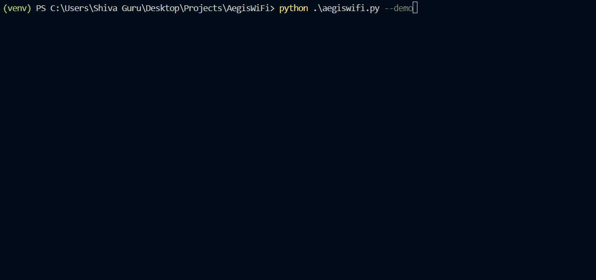

# 🛡️ AegisWiFi — Wireless Security Analyzer

## Working Demo

AegisWiFi is a **cross-platform wireless network security analysis tool** designed to identify risks, misconfigurations, and anomalies in nearby WiFi environments.

It performs **real-time scanning, security scoring, and intelligent risk detection** to provide a structured overview of wireless network security.

---

## Features

**CROSS-PLATFORM SCANNING**

  * Windows (`netsh`)
  * Linux (`nmcli`)

**Security Analysis Engine**

  * Risk scoring (0–100)
  * Network classification
  * Security interpretation

**Threat & Risk Detection**

  * Open network detection
  * Weak encryption (WEP / legacy WPA)
  * Hidden SSID identification
  * Duplicate SSID detection *(possible evil twin)*
  * Channel congestion analysis

  **Environment Summary**

  * Overall risk level
  * Secure vs vulnerable networks breakdown

  **Export Capability**

  * CSV report generation

---

## How It Works

1. Scans nearby wireless networks
2. Parses network data into structured objects
3. Applies a security scoring model
4. Detects anomalies and misconfigurations
5. Outputs a clean, human-readable report

---

## Installation

```bash
git clone https://github.com/cybxrghoul/AegisWiFi.git
cd AegisWiFi
pip install -r requirements.txt
```

---

## Usage

### Windows

```powershell
python aegiswifi.py
```

### Linux (Kali / Parrot / Ubuntu)

```bash
python3 aegiswifi.py
```

---

## Example Output

```
[1] HomeLab_5G
  BSSID       : AA:BB:CC:11:22:33
  Signal      : 82%
  Channel     : 36
  Security    : WPA2-Personal / CCMP
  Score       : 78/100
  Assessment  : Moderately Secure

[2] Cafe_Free_WiFi
  Security    : Open
  Score       : 15/100
  Assessment  : High Risk
  Warnings    :
    - Open network detected
```

---

## Security & Privacy Notice

* This tool performs **passive analysis only**
* No packet injection or intrusive actions are performed
* Users should **only analyze networks they own or are authorized to assess**

---

## Limitations

* Windows requires **Location Services enabled** for WiFi scanning
* Virtual machines may not detect WiFi interfaces without hardware passthrough
* Detection of rogue access points is **heuristic-based**, not definitive

---

## Future Improvements

* Go-based high-performance scanning module
* Real-time monitoring mode
* Advanced anomaly detection using ML
* GUI dashboard
* Integration with threat intelligence sources

---

## Author

**Shiva Guru**
Cybersecurity Enthusiast | Detection Engineering | OSINT

---

## ⭐ Contribute / Support

If you found this useful, consider starring ⭐ the repository!
